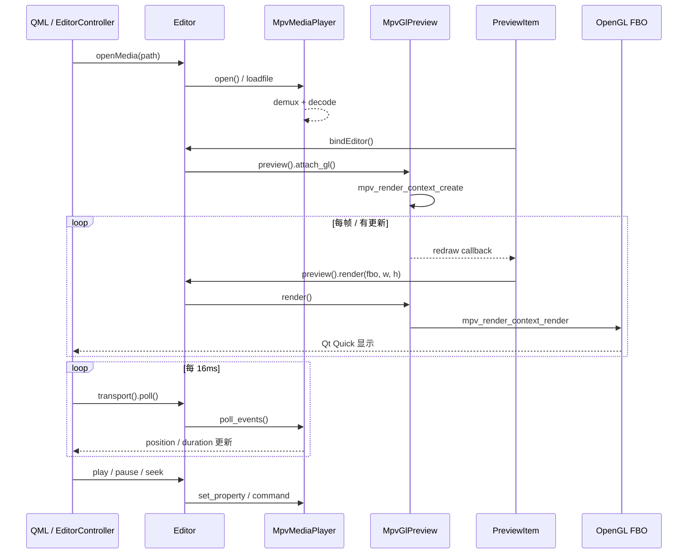

# LiteFrame Editor

基于 **Qt Quick (QML) + libmpv** 的桌面视频预览编辑器。Core 为 C++，通过 **Editor 门面**对外暴露唯一公共头文件；播放与渲染拆分为独立模块，底层共享 `MpvSession`。

## 依赖

```bash
brew install mpv
```

CMake 通过 `pkg-config` 链接 `libmpv`（选项 `LF_ENABLE_MPV=ON`，默认开启）。

## 目录结构

```
lf-editor/
├── app-qt/
│   ├── preview_controller.cpp      # preview → QML 预览桥接
│   ├── transport_controller.cpp    # transport → QML 走带桥接
│   ├── preview_item.cpp            # PreviewViewport 控件
│   └── qml/
│       ├── Main.qml                # 应用壳：菜单、对话框、布局
│       ├── PreviewPanel.qml        # 预览区（preview + 拖拽）
│       ├── TransportBar.qml        # 走带（transport）
│       └── StatusBar.qml           # 状态栏
└── core/
    ├── include/
    │   └── lf_editor.h             # 唯一对外公共 API
    ├── common/
    │   └── lf_mpv_session.*        # 共享 mpv_handle + 事件状态
    ├── player/
    │   ├── abstract/
    │   │   └── lf_media_player.h   # 播放抽象（core 内部）
    │   └── lf_mpv_media_player.*   # mpv Client API 实现
    ├── render/
    │   ├── abstract/
    │   │   └── lf_preview_renderer.h  # 渲染抽象（core 内部）
    │   └── lf_mpv_gl_preview.*     # mpv Render API 实现
    ├── timeline/                   # 时间线（stub）
    └── export/                     # 导出（stub）
```

**依赖方向**：`app-qt` 只 `#include "lf_editor.h"`；`player/` 与 `render/` 均依赖 `common/MpvSession`，互不 include。

## 架构概览

```
main()
  └── lf::Editor editor              ← 唯一实例

  TransportController transport(&editor) → QML: transport
  PreviewController   preview(&editor)   → QML: preview

PreviewItem → PreviewController → editor.preview()
TransportController → editor.transport() / load_media
```

| 类 | 职责 |
|---|---|
| `Editor` | 对外唯一入口：`load_media` / `export_timeline` |
| `Editor::Transport` | 走带：play / pause / seek / poll / position |
| `Editor::Preview` | 预览 GL：attach_gl / render / redraw 回调 |
| `MpvMediaPlayer` | mpv Client API（core 内部） |
| `MpvGlPreview` | mpv Render API（core 内部） |
| `MpvSession` | 共享 `mpv_handle`，缓存 position/duration/playing |
| `PreviewItem` | OpenGL FBO，调用 `editor.preview()` |
| `TransportController` | 走带 QML 桥接：play / seek / poll / 进度条 |
| `PreviewController` | 预览 QML 桥接：attach_gl / render / redraw 回调 |
| `PreviewItem` | 绑定 `PreviewController`，负责 FBO 控件 |

## libmpv 两套 API

| 对象 | 头文件 | 用途 | 封装类 |
|---|---|---|---|
| `mpv_handle*` | `mpv/client.h` | 命令、属性、事件 | `MpvMediaPlayer` |
| `mpv_render_context*` | `mpv/render.h` | OpenGL 出帧 | `MpvGlPreview` |

两者通过 `MpvSession::mpv` 关联：`mpv_render_context_create(&render, mpv, ...)`。

配置 `vo=libmpv` 表示不由 mpv 自己开窗口，帧通过 **Render API** 交给应用绘制。

---

## 数据走向

### 通路 A：播控状态 → QML UI

```
QTimer (16ms)
  → EditorController::pollPlayer()
       → Editor::transport().poll()
            → MpvMediaPlayer::poll()
                 → MpvSession::poll_events()
                      → mpv_wait_event(0) → 更新 position / duration / pause
       → emit positionChanged() / durationChanged()
            → QML Slider、时间 Label
```

用户 Play/Pause/Seek 走 `Editor::transport().play/pause/seek()`，经 `MpvMediaPlayer` 调 mpv API；拖动 Slider 时 `seeking=true`，暂时屏蔽 poll 对 position 的覆盖。

### 通路 B：视频像素 → 预览画面

```
mpv 解码出新帧
  → mpv_set_wakeup_callback / mpv_render_context_set_update_callback
       → Editor::preview().set_redraw_callback 注册的 lambda
            → PreviewItem::requestRedraw() → update()

PreviewGlRenderer::render()          // Qt 渲染线程
  → Editor::preview().attach_gl(getProcAddress)   // 首次
  → Editor::preview().render(fbo, w, h)
       → MpvGlPreview::render()
            → mpv_render_context_render() → OpenGL FBO
  → Qt Quick 合成 FBO 纹理 → 屏幕
```

应用层 **不直接接触 YUV buffer**；像素在 mpv + GL 内部流动。

### 通路 C：打开文件

```
UI: controller.openMedia(path)
  → Editor::load_media(path)
       → MpvMediaPlayer::open() → mpv_command("loadfile")
       → OtioTimeline::add_clip()   // 时间线元数据
  → emit hasMediaChanged() → PreviewItem::update()
```

---

## mpv 调用流程

### 1. 初始化（`MpvSession` 构造）

```
mpv_create()
  → mpv_set_option_string("vo", "libmpv")
  → mpv_set_option_string("idle", "yes")
  → mpv_set_option_string("pause", "yes")
  → mpv_observe_property("time-pos" | "duration" | "pause")
  → mpv_set_wakeup_callback(on_mpv_wakeup)
  → mpv_initialize()
```

此时 **尚未** 创建 `mpv_render_context`。

**相关代码**：`core/common/lf_mpv_session.cpp`

---

### 2. 打开文件

```
EditorController::openMedia(path)
  → Editor::load_media(path)
       → MpvMediaPlayer::open(path)
            → mpv_command("loadfile", path)
```

| 事件 | 处理 |
|---|---|
| `MPV_EVENT_FILE_LOADED` | `has_media = true`，读取 `duration` |
| `MPV_EVENT_PROPERTY_CHANGE` | 更新 `time-pos`、`pause` 等 |
| `MPV_EVENT_END_FILE` | `has_media = false` |

---

### 3. 绑定 OpenGL（首次预览绘制）

```
PreviewItem::bindEditor(&editor)
  → Editor::preview().set_redraw_callback(...)
  → Editor::preview().detach_gl()   // 切换时清理

PreviewGlRenderer::render() 第一次：
  → Editor::preview().attach_gl(getProcAddress)
       → MpvGlPreview::attach_gl()
            → mpv_render_context_create(...)
            → mpv_render_context_set_update_callback(...)
```

**相关代码**：`app-qt/preview_item.cpp`、`core/render/lf_mpv_gl_preview.cpp`

---

### 4. 每一帧预览

```
PreviewGlRenderer::render()
  → Editor::preview().render(fbo_id, w, h)
       → mpv_render_context_render(
            MPV_RENDER_PARAM_OPENGL_FBO = { fbo, w, h },
            MPV_RENDER_PARAM_FLIP_Y     = 1
          )
```

事件 poll 由 **通路 A** 的 `Editor::transport().poll()` 统一处理，不在 render 线程重复调用。

---

### 5. 播控

| 用户操作 | 调用链 | mpv API |
|---|---|---|
| Play | `Editor::transport().play()` → `MpvMediaPlayer::play()` | `mpv_set_property("pause", 0)` |
| Pause | `Editor::transport().pause()` | `mpv_set_property("pause", 1)` |
| Seek | `Editor::transport().seek(t)` | `mpv_command("seek", t, "absolute")` |

---

### 6. 销毁

```
PreviewItem 析构 / bindEditor 切换
  → Editor::preview().detach_gl()
       → mpv_render_context_free()

Editor 析构
  → mpv_terminate_destroy(mpv)
```

---

## 流程图



---

## Client API 与 Render API 对照

| 阶段 | Client API (`mpv_handle`) | Render API (`mpv_render_context`) |
|---|---|---|
| 创建 | `mpv_create` / `mpv_initialize` | `mpv_render_context_create`（需 GL） |
| 加载 | `mpv_command("loadfile")` | — |
| 播控 | `mpv_set_property` / `mpv_command("seek")` | — |
| 状态 | `mpv_observe_property` + `mpv_wait_event` | — |
| 出画 | — | `mpv_render_context_render` → FBO |
| 销毁 | `mpv_terminate_destroy` | `mpv_render_context_free` |

---

## `mpv_render_param` 用法（本项目）

创建 render context：

```cpp
mpv_render_param params[] = {
    {MPV_RENDER_PARAM_API_TYPE, "opengl"},
    {MPV_RENDER_PARAM_OPENGL_INIT_PARAMS, &gl_init},
    {MPV_RENDER_PARAM_INVALID, nullptr},
};
mpv_render_context_create(&render, mpv, params);
```

每帧渲染：

```cpp
mpv_render_param params[] = {
    {MPV_RENDER_PARAM_OPENGL_FBO, &target},
    {MPV_RENDER_PARAM_FLIP_Y, &flip_y},
    {MPV_RENDER_PARAM_INVALID, nullptr},
};
mpv_render_context_render(render, params);
```

数组必须以 `MPV_RENDER_PARAM_INVALID` 结尾。

---

## 关键源文件

| 文件 | 内容 |
|---|---|
| `core/include/lf_editor.h` | 唯一对外公共 API（pimpl） |
| `core/lf_editor.cpp` | Editor 实现，聚合 session / player / preview / timeline |
| `core/common/lf_mpv_session.cpp` | mpv 会话与事件处理 |
| `core/player/lf_mpv_media_player.cpp` | mpv Client API |
| `core/render/lf_mpv_gl_preview.cpp` | mpv Render API |
| `app-qt/preview_item.cpp` | GL 上下文、FBO、`Editor::preview()` |
| `app-qt/editor_controller.cpp` | Qt 桥接与 poll 定时器 |
| `app-qt/main.cpp` | `QQuickWindow::setGraphicsApi(OpenGL)` |

---

## 构建与运行

```bash
cd lf-editor
cmake -B build -DCMAKE_BUILD_TYPE=Debug
cmake --build build
open build/app-qt/lf-editor.app
```

Qt Creator 使用 Kit 构建时，需 **Rebuild** 以同步 QML 模块。

---

## 参考

- [mpv client API](https://mpv.io/manual/master/client-api/)
- [mpv render API](https://mpv.io/manual/master/render-api/)
- 本机头文件：`/opt/homebrew/include/mpv/client.h`、`render.h`、`render_gl.h`
