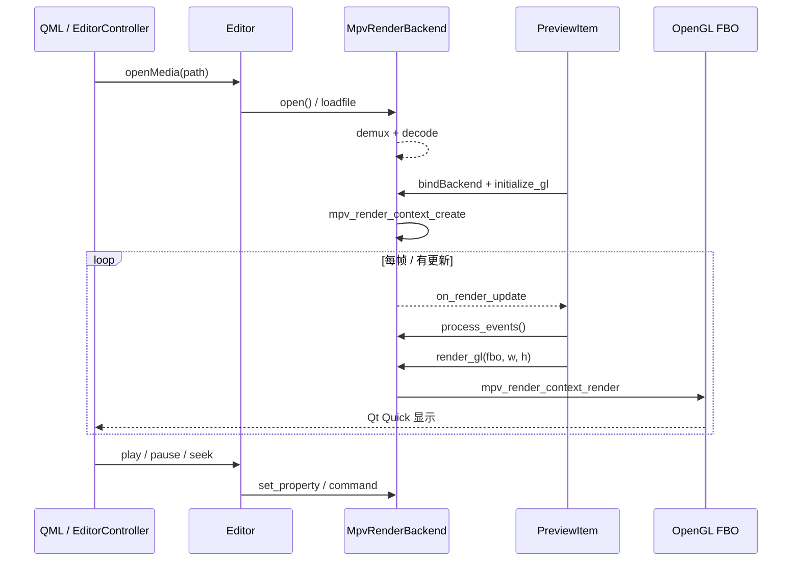

# LiteFrame Editor

基于 **Qt Quick (QML) + libmpv** 的桌面视频预览编辑器。Core 为 C++，播放由 `MpvRenderBackend` 封装 libmpv 的 **Client API** 与 **Render API**。

## 依赖

```bash
brew install mpv
```

CMake 通过 `pkg-config` 链接 `libmpv`（选项 `LF_ENABLE_MPV=ON`，默认开启）。

## 架构概览

```
QML (Main.qml)
    ↓
EditorController          # Qt 桥接：属性、文件、定时 poll
    ↓
Editor                    # 业务编排：load_media、timeline、export
    ↓
MpvRenderBackend          # libmpv 封装
    ├── mpv_handle        # Client API：播控、属性、事件
    └── mpv_render_context # Render API：OpenGL 出帧

PreviewItem (QML)         # QQuickFramebufferObject
    ↓ initialize_gl / render_gl
OpenGL FBO → Qt Quick 合成 → 屏幕
```

| 类 | 职责 |
|---|---|
| `Editor` | 打开媒体、更新 timeline、转发 play/pause/seek、导出 |
| `MpvRenderBackend` | 仅负责 mpv：加载文件、播控、事件、GL 渲染 |
| `PreviewItem` | 提供 OpenGL 上下文与 FBO，调用 `render_gl()` |
| `EditorController` | 16ms 定时 `Editor::poll()`，同步进度条 |

## libmpv 两套 API

`MpvRenderBackend::Impl` 内有两个核心对象：

| 对象 | 头文件 | 用途 |
|---|---|---|
| `mpv_handle*` | `mpv/client.h` | 命令、属性、事件（`loadfile`、`pause`、`seek`） |
| `mpv_render_context*` | `mpv/render.h` | 把解码后的帧画进 OpenGL FBO |

配置 `vo=libmpv` 表示不由 mpv 自己开窗口，帧通过 **Render API** 交给应用绘制。

---

## mpv 调用流程

### 1. 初始化（`MpvRenderBackend` 构造）

```
mpv_create()
  → mpv_set_option_string("vo", "libmpv")
  → mpv_set_option_string("idle", "yes")
  → mpv_set_option_string("pause", "yes")    # 默认暂停，便于显示首帧
  → mpv_observe_property("time-pos" | "duration" | "pause")
  → mpv_set_wakeup_callback(on_mpv_wakeup)   # 有事件时通知 UI 重绘
  → mpv_initialize()
```

此时 **尚未** 创建 `mpv_render_context`，也 **没有** 媒体文件。

**相关代码**：`core/player/lf_mpv_render_backend.cpp` → 构造函数。

---

### 2. 打开文件（控制流，无像素）

```
UI: controller.openMedia(path)
  → Editor::load_media(path)
       → MpvRenderBackend::open(path)
            → mpv_command("loadfile", path)
```

mpv 内部（黑盒）：

```
磁盘 mp4/mov
  → demux（libavformat）
  → decode（libavcodec → YUV 帧）
  → 等待 render 取帧
```

异步事件：

| 事件 | 处理 |
|---|---|
| `MPV_EVENT_FILE_LOADED` | `has_media = true`，读取 `duration` |
| `MPV_EVENT_PROPERTY_CHANGE` | 更新 `time-pos`、`pause` 等 |
| `MPV_EVENT_END_FILE` | `has_media = false` |

**相关代码**：`open()`、`Impl::handle_event()`。

---

### 3. 绑定 OpenGL（首次预览绘制）

```
PreviewItem::bindBackend(&editor.player())
  → set_update_callback → 请求 QML update()

PreviewRenderer::render() 第一次：
  → initialize_gl(lambda: QOpenGLContext::getProcAddress)
       → mpv_render_context_create(
            MPV_RENDER_PARAM_API_TYPE = "opengl",
            MPV_RENDER_PARAM_OPENGL_INIT_PARAMS = { gl_proc_address_resolver, ... }
          )
       → mpv_render_context_set_update_callback(on_render_update)
```

`gl_proc_address_resolver` 是 C 回调桥：mpv 需要查 OpenGL 函数地址（如 `glBindFramebuffer`）时，转调 Qt 的 `getProcAddress`。

**相关代码**：

- `core/player/lf_mpv_render_backend.cpp` → `initialize_gl()`
- `app-qt/preview_item.cpp` → `PreviewRenderer::render()`

---

### 4. 每一帧预览（像素流）

```
PreviewRenderer::render()
  ① process_events()              # 非阻塞处理 mpv 事件队列
  ② render_gl(fbo_id, w, h)
       → mpv_render_context_render(
            MPV_RENDER_PARAM_OPENGL_FBO = { fbo, w, h },
            MPV_RENDER_PARAM_FLIP_Y     = 1
          )
```

数据流：

```
H.264 码流 → 解码(YUV) → mpv 内部 scale/色彩 → OpenGL 画入 FBO
  → Qt Quick 将 FBO 作为纹理 → 屏幕
```

应用层 **不直接接触 YUV buffer**；像素在 mpv + GL 内部流动。

**相关代码**：`process_events()`、`render_gl()`。

---

### 5. 播控

| 用户操作 | 调用链 | mpv API |
|---|---|---|
| Play | `Editor::play()` → `MpvRenderBackend::play()` | `mpv_set_property("pause", 0)` |
| Pause | `Editor::pause()` | `mpv_set_property("pause", 1)` |
| Seek | `Editor::seek(t)` | `mpv_command("seek", t, "absolute")` |

播控只改 mpv 状态；新帧就绪后触发 `on_render_update` → UI `update()` → 再次 `render_gl()`。

---

### 6. 事件与重绘（两条通知链）

| 回调 | 触发源 | 作用 |
|---|---|---|
| `on_mpv_wakeup` | mpv 核心线程有事件 | 通知 UI 处理事件 / 重绘 |
| `on_render_update` | 有新视频帧可画 | 通知 UI 调用 `render_gl` |

两者最终都通过 `set_update_callback` → `PreviewItem::requestRedraw()` → `update()`。

另外，`EditorController` 每 **16ms** 调用 `Editor::poll()` → `process_events()`，用于刷新进度条（`time-pos`），不依赖是否重绘。

---

### 7. 销毁

```
PreviewItem 析构 / bindBackend 切换
  → MpvRenderBackend::destroy_gl()
       → mpv_render_context_free()

MpvRenderBackend 析构
  → mpv_terminate_destroy(mpv)
```

---

## 流程图



---

## Client API 与 Render API 对照

| 阶段 | Client API (`mpv_handle`) | Render API (`mpv_render_context`) |
|---|---|---|
| 创建 | `mpv_create` / `mpv_initialize` | `mpv_render_context_create`（需 GL） |
| 加载 | `mpv_command("loadfile")` | — |
| 播控 | `mpv_set_property` / `mpv_command("seek")` | — |
| 状态 | `mpv_observe_property` + `mpv_wait_event` | — |
| 出画 | — | `mpv_render_context_render` → FBO |
| 销毁 | `mpv_terminate_destroy` | `mpv_render_context_free` |

---

## `mpv_render_param` 用法（本项目）

创建 render context：

```cpp
mpv_render_param params[] = {
    {MPV_RENDER_PARAM_API_TYPE, "opengl"},
    {MPV_RENDER_PARAM_OPENGL_INIT_PARAMS, &gl_init},
    {MPV_RENDER_PARAM_INVALID, nullptr},
};
mpv_render_context_create(&render, mpv, params);
```

每帧渲染：

```cpp
mpv_render_param params[] = {
    {MPV_RENDER_PARAM_OPENGL_FBO, &target},  // FBO id + 宽高
    {MPV_RENDER_PARAM_FLIP_Y, &flip_y},      // Qt FBO 需 flip_y=1
    {MPV_RENDER_PARAM_INVALID, nullptr},
};
mpv_render_context_render(render, params);
```

数组必须以 `MPV_RENDER_PARAM_INVALID` 结尾。

---

## 关键源文件

| 文件 | 内容 |
|---|---|
| `core/include/lf_mpv_render_backend.h` | 对外 API |
| `core/player/lf_mpv_render_backend.cpp` | mpv Client + Render 实现 |
| `core/lf_editor.cpp` | 聚合 player / timeline / export |
| `app-qt/preview_item.cpp` | GL 上下文、FBO、`render_gl` 调用 |
| `app-qt/editor_controller.cpp` | Qt 桥接与事件 poll |
| `app-qt/main.cpp` | `QQuickWindow::setGraphicsApi(OpenGL)` |

---

## 构建与运行

```bash
cd lf-editor
cmake -B build -DCMAKE_BUILD_TYPE=Debug
cmake --build build
open build/app-qt/lf-editor.app
```

Qt Creator 使用 Kit 构建时，需 **Rebuild** 以同步 QML 模块。

---

## 参考

- [mpv client API](https://mpv.io/manual/master/client-api/)
- [mpv render API](https://mpv.io/manual/master/render-api/)
- 本机头文件：`/opt/homebrew/include/mpv/client.h`、`render.h`、`render_gl.h`
